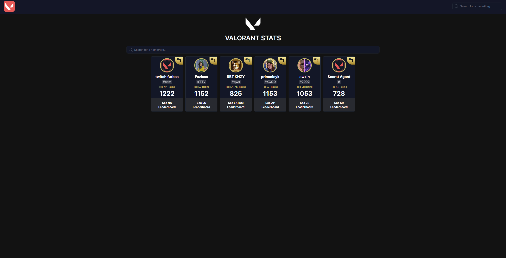
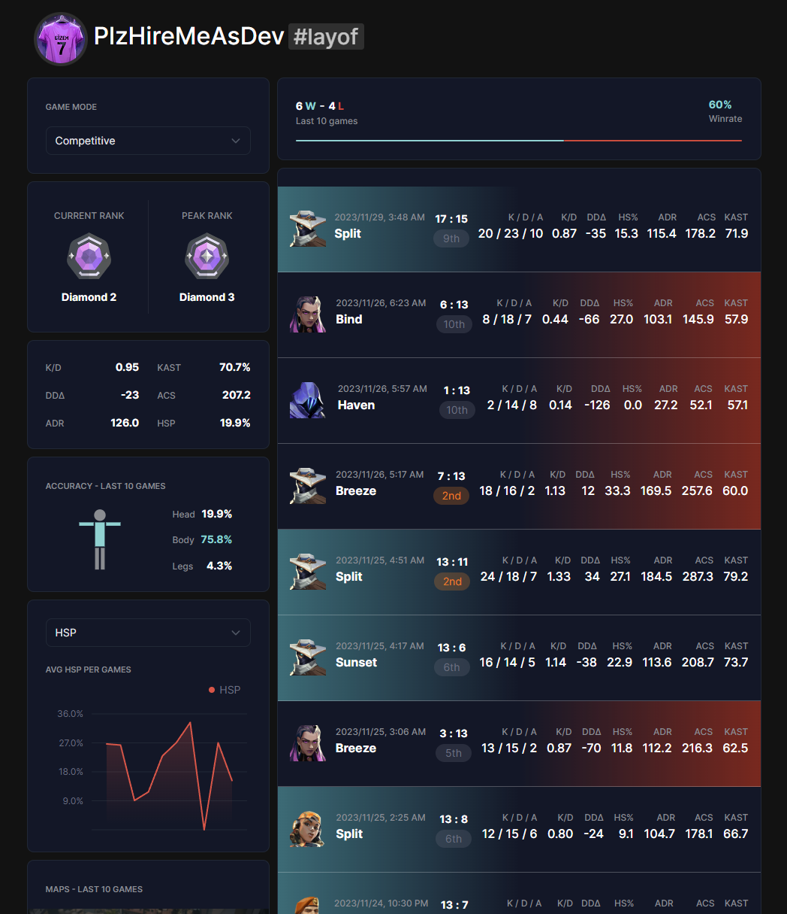
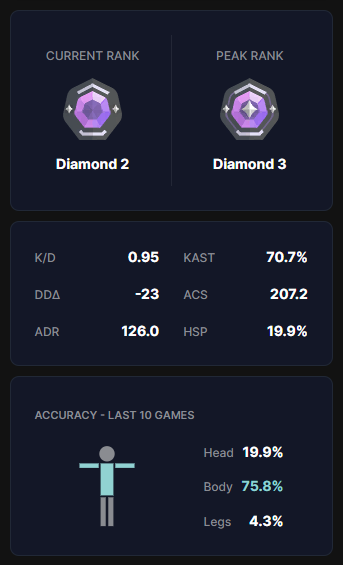
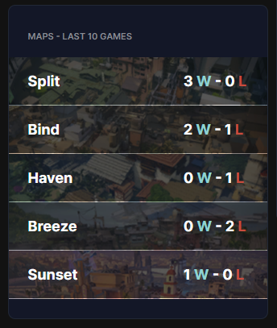
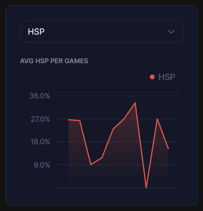
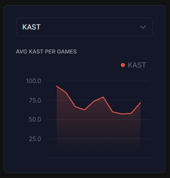
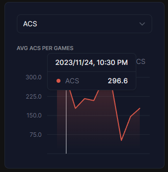
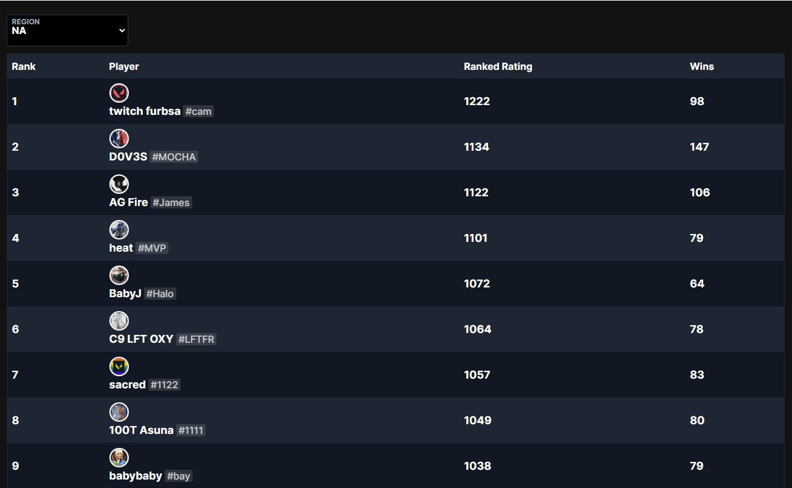
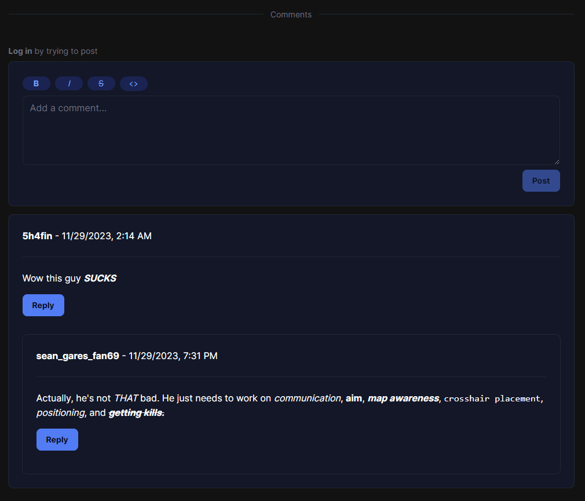

# Valorant Stats Website

## Overview

Inspired by [tracker.gg](https://tracker.gg/valorant) and [blitz.gg](https://blitz.gg/valorant), this web app was built using Next.js and TypeScript as a learning project to create a similar convenient platform for tracking your in-game statistics in Valorant just like those sites.

Leveraging HenrikDev's [unofficial Valorant API](https://app.swaggerhub.com/apis-docs/Henrik-3/HenrikDev-API/3.0.0#/), the site fetches real-time data to keep you updated on your performance in your last 10 competitive games (more modes WIP).

You can check out a live deployed version of the website at https://val-stats.fly.dev.

Note: The site is using the no key version of HenrikDev's API. All API calls are rate limited to 30 requests a minute. API calls are cached for 5 minutes wherever possible to reduce number of calls.



## Features

### Player Stats

View detailed statistics for your Valorant profile, including kills, deaths, wins, and more!


 

Check out interactive graphs for multiple stats!

 


<!--  -->

### Leaderboard

Check out the top players on the leaderboard in every region!



### Comments

Engage with the community by adding comments to individual player profiles. Share strategies, tips, or connect with fellow gamers!



# Running locally

You will also need to have the val-stats-server project running for the comments feature to work. Check out https://github.com/Shafin-A/val-stats-server

### Clone the Repository:

```bash
git clone https://github.com/Shafin-A/val-stats.git
```

### Install Dependencies:

```bash
npm install
```

### Run the Application:

```bash
npm run dev
```

### Open in Browser:

Visit http://localhost:3000 to explore the Valorant Stats Tracker.
